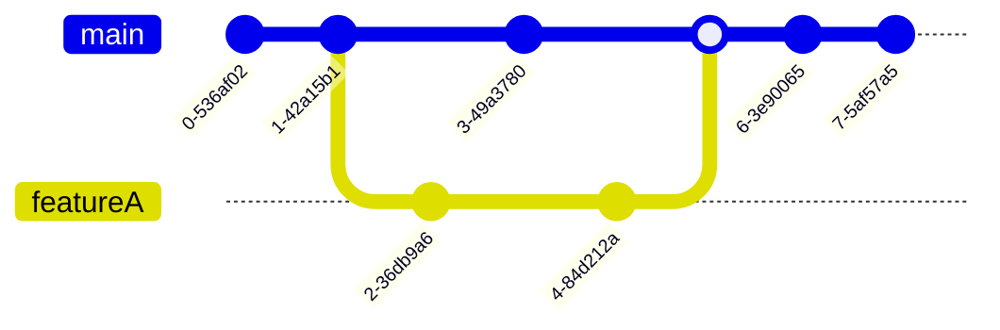

# Contribution Guideline

To provide new features of bug fixes create a new branch and open a merge request to main.
For more information about this consider the chapter [Git Workflow](#git-workflow)

## Commit Message

As convention we strongly encourage to use conventional commit messages.
This type of commit message applies a special scheme to the commit headline, described below.

General Syntax: `type(scope): description`

|     Type | Definition                                                                                             |
| -------: | :----------------------------------------------------------------------------------------------------- |
|    build | Changes that affect the build system or external dependencies                                          |
|    chore | Cleanup of files/folders                                                                               |
|       ci | Changes to our CI configuration files and scripts                                                      |
|     docs | Documentation only changes                                                                             |
|     feat | A new feature                                                                                          |
|      fix | A bug fix                                                                                              |
|     perf | A code change that improves performance                                                                |
| refactor | A code change that neither fixes a bug nor adds a feature                                              |
|   revert |                                                                                                        |
|    style | Changes that do not affect the meaning of the code (white-space, formatting, missing semi-colons, etc) |
|     test | Adding missing tests or correcting existing tests                                                      |

[Further Reading](https://www.conventionalcommits.org/en/v1.0.0/)

## Git Workflow

### `main` Branch

Always ready to deploy => **source code can be compiled and all test are successful**

### `feature` Branch

New features are each developed in new branches different from `main`.
These branches can be created by executing `git checkout -b <feature>` and be published to GitHub via `git push --set-upstream <feature>`.
After the feature is completed the feature branch will be merged back to `main` by creating a merge request in GitHub.

## Git Basics

Clone a repository:
`git clone <url>`

Load all Submodules:
`git submodule update --init --recursive`

Update local history:
`git fetch --all`

Download latest from server:
`git pull`

Change working branch:
`git checkout <branch>`

Create new working branch:
`git checkout -b <branch>`

Add files to commit:
`git add <files>`

Commit Files:
`git commit -m <message>`

Upload changes to server:
`git push`

Change the remote URL:
`git remote set-url <remote> <new_url>`
