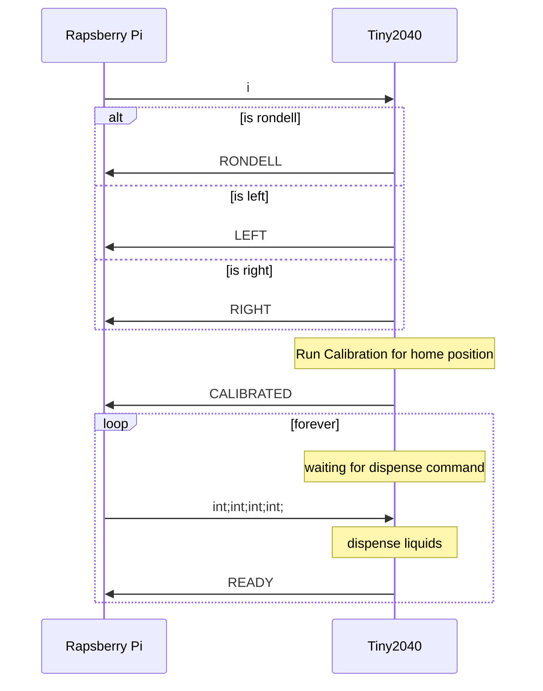

# Communication Protocol

The communication protocol defines the messages exchanged between the Rapsberry Pi (UI/Master) and the Tiny2040 (Stepper Controller).

## Commands

|          Command | Description                                      |
| ---------------: | :----------------------------------------------- |
|                i | Request identifier                               |
|             LEFT | Identifier for left controller                   |
|            RIGHT | Identifier for right controller                  |
|          RONDELL | Identifier for rondell controller                |
|                F | Signals wrong command                            |
|       CALIBRATED | Hardware is calibrated and ready to be used      |
|            READY | Message was handled and waiting for next command |
| int;int;int;int; | Sequence of drink dispensing                     |

## Syntax

Standard Syntax:
`<command>\n`

Dispense liquids:
`<halt_time_dispenser_1>;<halt_time_dispenser_2>;<halt_time_dispenser_3>;<halt_time_dispenser_4>;\n`

## Communication Sequence

