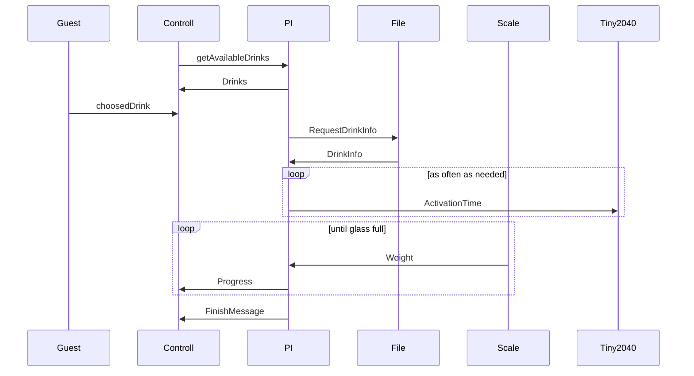
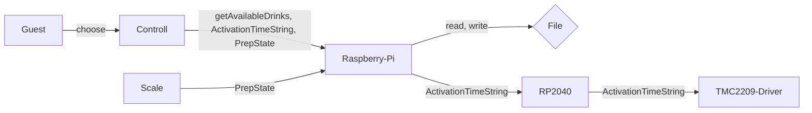

# Concept

Die Anwendung zeigt eine Liste von verfügbaren Getränken an, der Gast wählt ein verfügbares Getränk aus und wählt die Größe des Getränks aus.
Die Anwendung holt sich die Informationen zu Erstellung des Getränks und berechnet die zugehörigen Aktivierungszeiten der Dispenser.
Diese Aktivierungszeit wird als Zeichenkettencode an den Pico übermittelt, der über die Motoren die Dispenser steuert.
Der Nutzer bekommt den Fortschritt der Getränkezubereitung auf dem Bildschirm angezeigt.
Die Rezepte bestehen aus einem Namen, der Zutatenliste, Fließgeschwindigkeit der Zutaten und dem Mischungsverhältnis der Zutaten.

## Semantik

Beispiel für den Code: `5000;11500;0;0;\n`

**Bedeutung:**\
Dispenser 1 für 5000ms aktivieren;\
Dispenser 2 für 11500 ms aktivieren;\
Dispenser 3 für 0 ms aktivieren;\
Dispenser 4 für 0 ms aktivieren;

Siehe [Communication Protocol](./communicationProtocol.md)

---

## Verfeinerung des Use-Case: Gast wählt Getränk aus und startet Zubereitung.

1.  Der Gast wählt über Bedienelement Getränk.
2.  Die Anwendung auf Bedienelement lädt eine Liste von Getränken, die derzeit gemischt werden können, aus einer Datei, die auf dem Raspberry-Pi liegt und zeigt sie ihm an.
3.  Der Gast wählt ein Getränk aus der Liste aus und gibt die gewünschte Größe des Getränks an.
4.  Die Anwendung ruft die Fließgeschwindigkeit jeder Zutat aus der Datei ab und berechnet die benötigte Menge an Zutaten für das ausgewählte Getränk und die gewünschte Größe.
5.  Die Anwendung berechnet die Aktivierungszeit für jeden Dispenser.
6.  Die Anwendung sendet die Aktivierungszeit für jeden Dispenser an die Pico-Controller, die für die Steuerung der Motoren über TMC2209-Treiber zuständig sind.
7.  Die Pico-Controller aktivieren über die Treiber die Dispenser entsprechenend den berechneten Aktivierungszeiten, um die Zutaten in das Mischgefäß zu geben.
8.  Die Anwendung überwacht den Fortschritt des Mischvorgangs, indem sie von der Waage das Gewicht übermittelt bekommt. Daraus wird der Balken des Fortschritts berechnet.
9.  Sobald der Mischvorgang abgeschlossen ist, gibt die Anwendung dem Gast eine Benachrichtigung aus, dass das Getränk fertig ist und wie lange es gedauert hat.
10. Der Gast nimmt das fertige Getränk aus der Getränkemischmaschine und ist vollkommen zufrieden :)

---

#### Ablaufdiagramm

#### Strukturorientiert

