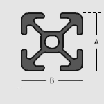
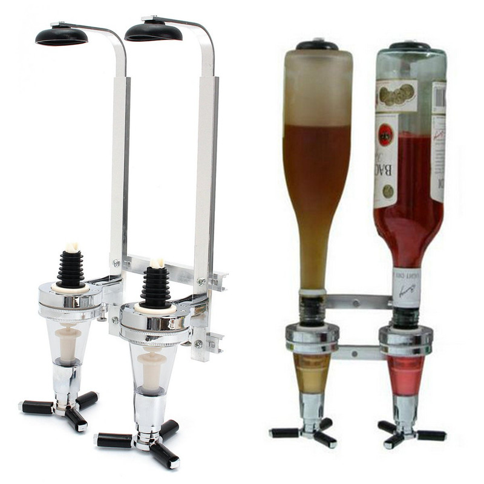
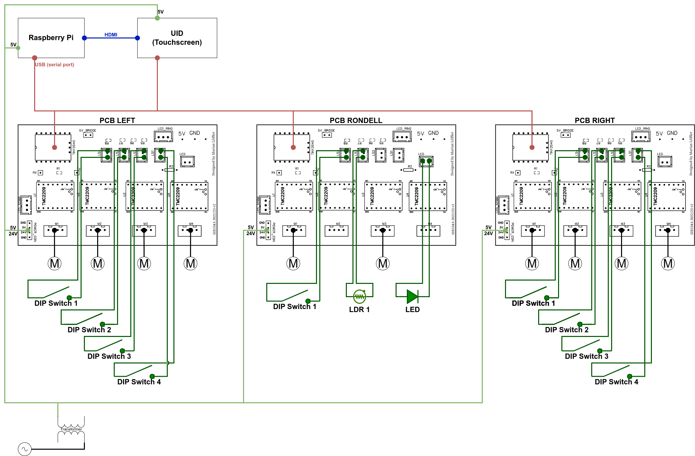
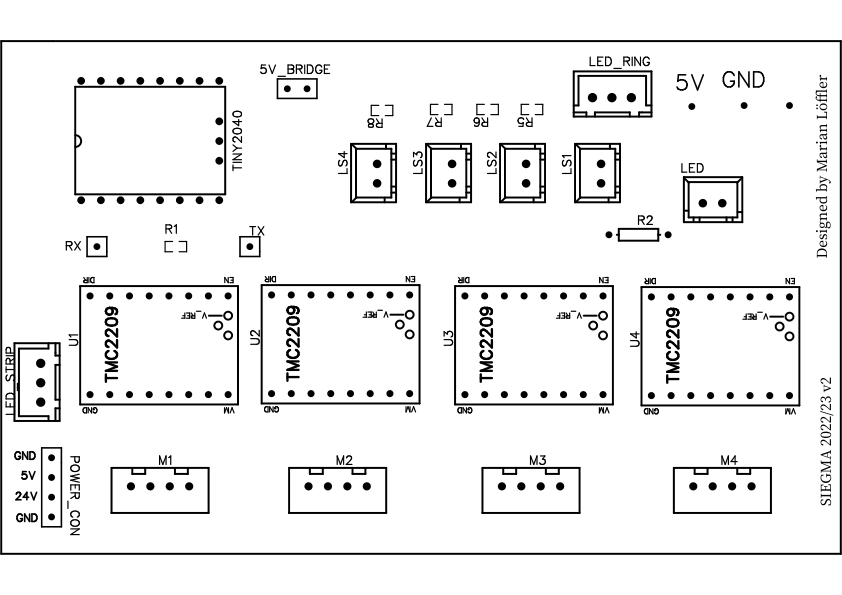

= Hardware
:hardbreaks:
:icons: font

The Drink Mixing Machine consists of several hardware parts.
There can be grouped into three categories, namely:

* <<_frame,Frame>>
* <<_dispenser_components,Dispenser Components>>
* <<_controlling_components,Controlling Components>>

== Frame

The frame is build from aluminium bases system profiles.

== Dispenser Components

The disepenser group consists of multiple components arranged around a standard bar dispenser as seen in image.

The dispenser is actuated by a 3D-printed arm which is lifted with a construction of ropes and deflection spools powerd by a stepper motor as the winch.

=== Metrics

.Manual Operation
====
3 to 5 seconds for the Dispenser to drain the liquid
=> 4 to 6 seconds to empty the Dispenser
====

.With the Machine
====
Requires 9 seconds to move up/down => 18 seconds to empty a Dispenser

CAUTION: Slow movement when closing is required in order to assure that the Dispenser is refilled
====

.Estimated Times for larger Dispenser (~250ml)
|===
|Dispenser |Manual Operation |Machine

|3cl |30s |90s
|4cl |24s |72s
|5cl |18s |54s
|===

TIP: 5cl Dispenser can significantly reduce the time required to dispense liquids which large amounts

==== Real World Test

.Mixing a Cocktail with 5 ingredients:
- 3 ingredients require 2cl each
- 2 ingredients require 10cl each

-> two runs are required with each 18 seconds => 36 seconds

== Controlling Components

The group of controlling components consits of a Raspberry Pi as the main controller of the machine combined with a custom PCB that has a Tiny2040 as a sub controller which controlls up to 4 stepper driver and sensors.

=== PCB

The PCB is custom made for the purpose of providing a controller that combines sensors and stepper drivers.

[NOTE]
.Rondell
====
[horizontal]
TINY2040::
  Tiny2040
POWER_CON::
  Power connection for the components
U1::
  Dispenser
U3::
  Rondell
LS4::
  Dispenser switch
LS3::
  light dependent resistor (LDR) of the rondell
LED::
  LED for LDR sensor of the rondell
====

[NOTE]
.Left/Right
====
The TMC2209 and sensors are connected regarding the number and the labels on the machine
====

.Datasheets
* link:../datasheets/TMC2209_datasheet_rev1.09.pdf[TMC2209]
* link:../datasheets/TMC2209_SilentStepStick_Rev110.pdf[TMC2209 SilentStepKick Board]
* link:https://shop.pimoroni.com/products/tiny-2040[Tiny2040]
* link:../datasheets/rp2040-datasheet.pdf[RP2040]

=== Raspberry Pi

The Raspberry Pi provides the GUI for the user and holds the required database for the drinks.
The Tiny2040 on the PCBs are connected via a serial port which is mapped dynmically during runtime.
The scale under the jar is directly connected to the Raspberry Pis GPIOs.

