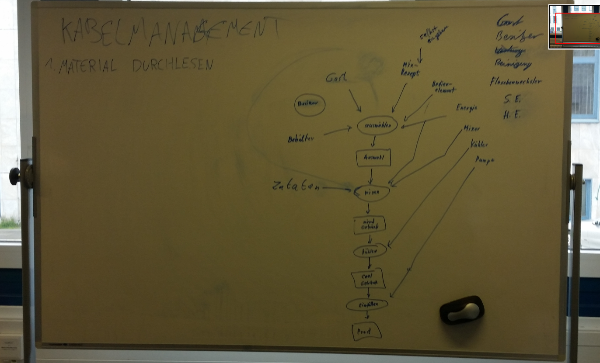

# Meeting: 2023-04-14

## Orga

Lukas ist vorerst unser Teamleiter, Leo unser Auftraggeber.

**Neuer Termin:** Wir treffen uns vorerst jede Woche dienstags um 14:00 Uhr.

## Ziel des Projektes

Unser **Hauptziel** in dieser Phase des Projekts: die Anforderungen an das System herausbekommen durch Hinterfragen von Leos Wünschen. Ggf. Leo Alternativen vorschlagen und Anforderungen verfeinern, bis implementierbare Stufe erreicht ist.

Unsere **Aufgabe** bis nächsten Dienstag: Dokumente querlesen, übergebenen Code compilieren und eventuelle Fehlermeldungen und überlegte Lösungsschritte dokumentieren. Ziel: feststellen, welche Anforderungen bereits erfüllt sind.

Leo hat eine Getränkemischautomat für Säfte und alkoholische Getränke entwickelt und will jetzt den Automaten verbessern, um ihn bei einer Party in einer Wohung oder im Garten einsetzen zu können.

Dafür stellt er uns Dokumente zur Verfügung und bereits geschriebenen Code.

## User-Story

Seine wichtigste Anforderungen sind, das Gerät soll zuverlässig dosierte Getränke in 30 Sekunden nach Auswahl eines Rezpets über das Bedienelement durch einen Gast bereitstellen. Die Dosierung sollte dabei auf hunderstel Liter (cl) genau sein.

Weiter ist ihm wichtig, Statistiken über die Nutzung des Geräts zu erhalten über ein Webinterface oder eine App. Insbesondere möchte er Daten über die Motoren haben und welche Getränke am liebsten zu welchem Anlass getrunken wurden.

Später soll ein Gasdrucksystem dazukommen, um Getränke mit Kohlensäure anzureichern und die Ausschenkzeit zu verkürzen. Weiter sollen später Getränke in den Schläuchen gekühlt werden können.

Und die GUI könnte überarbeitet werden. Beispielsweise findet er die Bedingung über den Scrollbalken suboptimal. Die Adminsicht sollte verschieden sein von der Nutzersicht.

Letztlich ist es ihm wichtig, dass er Rezepte in das System eingeben kann.

## Informationen

Eingeführte Rollen/Begriffe: siehe documentation/glossar.md

Das Gerät hat Rezepte gespeichert.
Diese Rezpete werden einem Gast über ein Display angezeigt Der Gast kann über ein Bedienelement ein Rezept auswählen und dann die Zubereitung starten.
Die Getränke werden nach Rezept im Trichter gemischt und über die Gewichtskraft in das Glas des Gastes eingefüllt.
